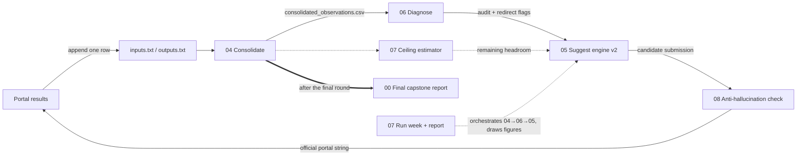

# 🎯 You Sank My Function — Black-Box Optimisation Capstone

**Imperial College Business School · Bayesian Optimisation Challenge**
**Eduardo Wizentier** · [wizentier@gmail.com](mailto:wizentier@gmail.com) · 30 August 2026

## In plain English

I used this challenge as a deep dive into machine learning. I began from scratch, working through tutorials, self-study and the literature on Gaussian processes and Bayesian optimisation before writing any of the pipeline. The task: eight hidden scoring machines, one guess each per week for thirteen weeks. Seven finished at or near the best score I could establish for them; the eighth could never be scored reliably. The diagnostics and neural sections then apply nearly every technique the course taught, including methods that never drove a query. This repository records a learning journey, so where notebooks disagree I left the disagreement in.

---

## The challenge

Eight hidden functions, 2-D to 8-D, on the unit cube $[0,1]^d$. One query per function per week, a one-week turnaround, and only noisy scalar responses to learn from. The goal is to maximise every function's normalised best-ever score:

$$ \text{score} = \frac{f(x^*) - f_{\text{initial best}}}{f_{\text{true max}} - f_{\text{initial best}}} $$

**Campaign complete — 13 weekly rounds, weeks 0–13, 279 observations, 104 weekly queries, 33 records set.**
Mean normalised score **0.9955** across the seven functions with defensible ceilings.

The governing principle is **diagnose first, then choose the method**. Every function is profiled before any optimiser touches it, classified into a pathology archetype from its own data, and routed to a strategy suited to that archetype. Four of the eight were ultimately reduced to parametric or closed-form models rather than treated as black boxes at all.

> **Start here:** [`pipeline/00_final_capstone_report.ipynb`](pipeline/00_final_capstone_report.ipynb) — the whole campaign on five A3 sheets.

---

## Final scoreboard

| F | dim | kind | initial best | final best | found | records | ceiling (basis) | score |
|---|-----|------|--------------|------------|-------|---------|-----------------|-------|
| F1 | 2 | deterministic | ~0 | **1.99995** | W11 | 7 | 2.0 · hypothesised | 0.99998 |
| F2 | 2 | noisy | 0.6112 | **0.65048** | W10 | 2 | 0.70 · speculative | 0.4424 * |
| F3 | 3 | noisy | −0.03484 | **−0.00037** | W12 | 4 | 0.0 · hard cap | 0.98938 |
| F4 | 4 | deterministic | −4.0255 | **0.65487** | W13 | 6 | 0.6549 · best-ever | 0.99999 |
| F5 | 4 | deterministic | 1088.86 | **8662.48** | W9 | 6 | 8662.48 · corner | 1.00000 |
| F6 | 5 | noisy | −0.71426 | **−0.23475** | W10 | 3 | −0.2247 · low conf. | 0.97948 |
| F7 | 6 | deterministic | 1.36497 | **3.32237** | W1 | 3 | 3.32237 · analytic | 1.00000 |
| F8 | 8 | deterministic | 9.59848 | **10.00000** | W2 | 2 | 10.0 · analytic | 1.00000 |

\* F2's true maximum cannot be usefully bounded — its seed "best" was itself an upward draw, and its own Week-3 replicate at the same input returned 0.5580. Its ceiling is marked speculative, so it is scored separately and carries a wide uncertainty whisker (0.283–0.805) rather than being dropped from the report.

**Where the score came from — six mechanisms across eight functions.** F7 and F8 were won by *recognising* the function rather than searching it. F5 by testing an axis that had been assumed rather than measured. F1 by a parametric model that extrapolated correctly four times running. F4 by a step that moved every coordinate at once, against the working prescription at the time. F3 by banking a lucky draw and refusing to redraw it. F2 by abandoning the seed region for one reading three sigma better. F6 stalled after W3 and its local geometry was never recovered — the one function not won, and FR3's near-empty panel says so plainly.

That spread is the central finding of the project: there was no single method, and the query budget was best spent working out *which kind of problem each function was* before deciding how to attack it.

---

## Repository map

```text
.
├── README.md                       ← you are here
├── LICENSE                         ← MIT (code + docs); data excluded, see datasheet
├── DATASHEET_AND_MODEL_CARD.md     ← dataset specification + model card
├── REFERENCES.md                   ← methods, algorithms, libraries + their sources
├── REVIEW_NOTES.md                 ← structural decisions and their rationale
├── requirements.txt
│
├── tutorials/    (A) 🎓 first-principles onboarding — not in the weekly loop
│   ├── 01_gp_bayesian_optimization_tutorial.ipynb   GP theory from scratch
│   ├── 02_gp_suggest_input_tutorial.ipynb           acquisition functions → query engine
│   └── 03_capstone_eda_and_prototype.ipynb          the EDA sandbox the pipeline grew out of
│
├── pipeline/     (B) ★ the production loop
│   ├── 00_final_capstone_report.ipynb      ⭐ the campaign retrospective — five A3 sheets
│   │   ── the weekly loop ──
│   ├── 04_consolidate_data.ipynb           raw sources → consolidated_observations.csv
│   ├── Preliminary_Pattern_Analysis.ipynb  label-blind re-read of all eight + hallucination watch
│   ├── 06_diagnose.ipynb                   gated two-tier diagnostic router + method audit
│   ├── 05_suggest_engine_v2.ipynb          pathology → strategy → referee → submission
│   ├── 07_ceiling_estimator.ipynb          predicted maximum per function, with bands
│   ├── 08_anti_hallucination_check.ipynb   seven-axis critic of the staged submission
│   ├── 07_run_week_and_report.ipynb        orchestrator (04→06→05) + weekly figures B1–B5
│   │   ── single-function deep dives ──
│   ├── 08_casino_case_study_v2.ipynb       F2/F3 winner's-curse forensics + policy tournament
│   ├── 09_harmonic_study_F2.ipynb          F2 aliasing retrial
│   ├── 09_transform_retrial_F3.ipynb       F3 multiplicative-noise retrial
│   └── *.csv, week*_engine_submission.txt  committed results (raw data is private)
│
├── diagnostics/  (C) 🔬 auxiliary intelligence — never selects a query
│   ├── A1_svm_analysis.ipynb · svm_analysis.py   SVR/SVC learnability, relevance, direction
│   ├── A2_logistic_regression.ipynb              top-vs-rest separability cross-check
│   ├── A3_landscape_gallery.ipynb                2-D slices of the hypothesised benchmarks
│   ├── A4_clustering_unsupervised.ipynb          K-Means · Ward · DBSCAN, scored against y
│   ├── A5_pca_dimensionality.ipynb               PCA · PLS · active subspaces · intrinsic dimension
│   └── figures/                                  written by A1 on run
│
└── neural/       (D) 🧠 deep-learning track + (future) LLM
    ├── 08_neural_surrogates_edu.ipynb       MLP / deep ensembles / DNGO / CNN vs GP (educational)
    ├── 09_neural_surrogates_F6.ipynb        build-and-ship nets for F6 (TF/Keras)
    └── 10_neural_surrogates_engine.ipynb    config-driven NN engine (F2 · F4 · F5)
```

Every notebook opens with a navigation banner stating what role it plays and linking to the rest of the repository. `pipeline/04_consolidate_data.ipynb` writes `function_summary.csv` on every run, so the project state is always derived from the data rather than from a hand-maintained document.

## Documentation & transparency

The data set and the optimisation approach are both formally documented in [**`DATASHEET_AND_MODEL_CARD.md`**](DATASHEET_AND_MODEL_CARD.md), which holds two complete and independent artefacts:

* [**Part 1 — Datasheet**](DATASHEET_AND_MODEL_CARD.md#part-1-datasheet-for-the-bbo-capstone-data-set) (Gebru et al. structure): motivation, composition and exact schema, collection process, preprocessing, recommended uses and misuses, distribution, maintenance. It states plainly what the data cannot support: at 23–53 observations per function with heavy exploitation bias, global-landscape claims are hypotheses, not findings.
* [**Part 2 — Model card**](DATASHEET_AND_MODEL_CARD.md#part-2-model-card-for-the-bbo-optimisation-approach) (Mitchell et al. structure): factors, metrics, training and evaluation data, disaggregated results per function *and per winning mechanism*, assumptions, failure modes, and ethical considerations.

Both are current to campaign close. Two disclosures in there are worth reading before the results: the metadata drift between the inlined table in `A1_svm_analysis`, the dictionary in `04_consolidate_data` and the weekly classifier, and the label-propagation limitation that stops the anti-hallucination critic catching errors it inherits from the engine it audits.

---

## Methodology

Each function is **diagnosed** before it is optimised — magnitude cascade, rank-correlation fingerprints, separability checks, noise-regime estimates from near-exact resamples, and benchmark-identity *falsification* against a single named candidate, never a library sweep. Only then is a method assigned.

That routing is automated in `05_suggest_engine_v2`, which classifies every function into one of six **pathology archetypes**, routes it to a strategy module emitting candidates *with provenance strings*, prices every candidate under one noise-aware referee GP (expected improvement and P(beat best-ever)), and enforces a global no-repeat guard before building the submission string. The classifier is **re-run from scratch every week** — archetypes are states, not identities — and §7 backtests the labels against the campaign's own history. Human overrides are supported and *logged*, never silent, so the engine's alternative always remains in the record beside the human pick.

| archetype | signature in the data | strategy | members |
|---|---|---|---|
| `needle` | magnitude cascade ≥6 decades, ≥50 % background | log-quadratic vertex fit + micro trust region | F1 |
| `stochastic_capped` | best-ever is an early draw; nearby re-reads never re-attain it | lottery: near-incumbent re-reads + maximin exploration | F2, F3 (to W9) |
| `local_peak` | new best-ever from a small step — a verified gradient | TuRBO-lite: continue ×1.5 on success, reverse-halve on failure | F2, F3, F4, F6 |
| `boundary_climb` | incumbent pinned at bounds, strong monotone trends | coordinate scans with capped extrapolation, priced on log scale | F5 |
| `plateau` | no new best for ≥3 weeks, not flat, not solved | price escape hypotheses: separable optimum, anti-correlated pairs | F6 (W4–W6) |
| `solved_lock` | analytic identity confirmed | ε-perturbation on the least-sensitive dimension | F7, F8 |

## The weekly loop



1. **Submit** the string produced by `05_suggest_engine_v2`, or run `07_run_week_and_report` end to end.
2. When results return, **append one row** to `inputs.txt` and `outputs.txt` — the only manual step in the loop.
3. **Re-run `07_run_week_and_report`**: it consolidates (04), re-audits every method against the fresh evidence (06 — redirect flags fire when the data stops supporting a method), regenerates the suggestion (05), and renders figures B1–B5.
4. **Before submitting**, run `08_anti_hallucination_check` on the staged string. It scores how much of the case for each probe is carried by data and how much by a model asserting things the data does not say.
5. **After the final round**, run `00_final_capstone_report` for the retrospective.

`07_ceiling_estimator` and the three deep-dive studies run on demand rather than every week — the ceilings when probe allocation is in question, the studies when a function stalls.

---

## The notebooks

### Pipeline (B)

**`00_final_capstone_report`** — the front matter of the submission: read first, run last. It reads `consolidated_observations.csv` and nothing else, and renders five A3 landscape sheets.

| Figure | What it shows |
|---|---|
| **FR1 · Final scoreboard** | Headline numbers, normalised score per function with ceiling-uncertainty whiskers |
| **FR2 · Campaign evolution** | Running best as a fraction of each ceiling, week by week, plus a ledger of every query that paid |
| **FR3 · Best-design gallery** | One landscape panel per function — a surrogate fitted to that function's own observations, sliced through the winning design along its two most influential coordinates |
| **FR4 · Best designs & evidence** | The winning input vector for all eight functions, beside the replicate evidence separating deterministic from noisy |
| **FR5 · Strengths, deviations, lessons** | What worked, what went wrong, what transfers — every claim measured from the data |

The only judgement calls are the per-function ceilings and labels, and both are surfaced as visible uncertainty whiskers rather than buried in the arithmetic. FR3 is the counterpart to `A3_landscape_gallery`: where A3 draws the *hypothesised* textbook benchmarks from their published formulas, FR3 draws what the campaign's own observations imply, with every measured point overlaid so the inference can be checked against the evidence at a glance.

**`04_consolidate_data`** — rebuilds the single tidy observation table from raw sources every week, so nothing downstream depends on hand-maintained notes. Audits integrity and exports the CSV that the rest of the pipeline reads.

**`Preliminary_Pattern_Analysis`** — a label-blind re-read of all eight functions. It deliberately sets aside the labels the pipeline already carries and screens closed-form families by cross-validated R², then places its verdict beside the prior label and flags where the prior looks like a story the numbers do not support. Its headline catch is F4: a global quadratic explaining 99 % of variance whose own maximum sits *below* points already observed.

**`06_diagnose`** — the gated two-tier router. Tier 0 is cheap structural signals that scope each function; Tier 1 is targeted confirmatory tests, run only when a Tier-0 signal or a stated prior points at them. "Insufficient evidence — keep current method" is a first-class verdict, and a `redirect` flag fires when the data contradicts the prior.

**`05_suggest_engine_v2`** — the generalised engine described above: classify, generate, price, constrain, submit.

**`07_ceiling_estimator`** — the denominator of the grade, estimated rather than assumed. One estimator per archetype, `low = best-ever` always, with an uncertainty band and a gallery showing the fit behind each number. A pathology-blind GP-UCB column is retained as the contrast.

**`08_anti_hallucination_check`** — a critic, not an oracle. Seven axes (support · model agreement · calibration · headroom · stability · resolvability · rationale), each printing its evidence, with decision flags kept deliberately *outside* the risk score so that buying information is never penalised as an error. Its self-check reports Spearman ρ ≈ +0.45 (p ≈ 1.4e-5, n = 88) between the pre-result risk proxy and realised surprise.

**`07_run_week_and_report`** — pure orchestration. Runs the real 04/06/05 in fixed order and reads their file outputs, holding no per-function metadata of its own so it can never become a copy that drifts.

**The deep dives (`08_casino`, `09_harmonic`, `09_transform`)** — forensic treatments of the two functions that resisted. Read in sequence they document a methodological arc: notebook 08 reaches a conclusion, and each 09 overturns it on the same data plus later weeks, for reasons stated precisely enough to check. Where two notebooks disagree, the later-numbered study is the standing verdict and the earlier one is preserved reasoning, not an uncorrected error.

### Diagnostics (C)

Auxiliary intelligence and theoretical depth. Nothing here selects a query, by design — the banners explain why. These notebooks are in the repository because the project is also a record of working the course's methods through real data, including the ones that turned out not to be the right tool for this problem.

**`A1_svm_analysis`** · **`A2_logistic_regression`** — supervised probes of learnability, per-dimension relevance and direction, and top-vs-rest separability.

**`A3_landscape_gallery`** — 2-D slices of the hypothesised benchmark landscapes, drawn from their published formulas.

**`A4_clustering_unsupervised`** — A1 and A2 need a label, so they manufacture one by thresholding `y`. A4 removes the label entirely and asks whether the *design geometry alone* falls into groups that happen to line up with good and bad outcomes. K-Means with geometric elbow and silhouette selection, Ward hierarchical clustering with dendrograms and cophenetic correlation, DBSCAN with a swept `eps` so the noise label marks where the design is thin, and cross-method agreement by adjusted Rand index. Every partition is scored with η² against a 2000-shuffle permutation test, because an unsupervised model always returns an answer and therefore always needs an external check. Section 6 is a deliberate worked mistake: clustering on `[X | y]` separates outcomes beautifully and is entirely circular.

**`A5_pca_dimensionality`** — asks the prior question: how many directions does the design actually live in, and are they the directions that matter? PCA derived by hand on F2 and verified three ways, component retention under four rules plus Horn's parallel analysis, bootstrap intervals on loadings, and sparse PCA for loadings that can be stated in a sentence. Its two load-bearing sections are the ones a generic PCA treatment cannot raise: §6 separates the design's own anisotropy from the optimiser's footprint by splitting initial from weekly points, and §8 shows that a strong PC1–`y` correlation can be manufactured by the acquisition function itself, classifying each association as genuine, search-induced, or inconclusive. It closes with the methods that use `y` on purpose — PLS and active subspaces — plus kernel PCA, Isomap/MDS/t-SNE benchmarked against a random projection, and intrinsic dimension by the Two-NN estimator.

Together A4 and A5 make the same point from two directions: at 23–53 observations in 2–8 dimensions, unsupervised structure is fragile, and the honest output is an effect size with a p-value rather than a convincing-looking scatter plot.

### Neural + LLM (D)

**`08_neural_surrogates_edu`** · **`09_neural_surrogates_F6`** · **`10_neural_surrogates_engine`** — MLPs, deep ensembles, DNGO and CNN surrogates benchmarked against the GP. The recurring finding is that at this data density the bottleneck is data, not model capacity, so the GP/structured pipeline remained the production route throughout. They were built anyway: knowing *why* a method loses on a given problem is part of what the project set out to learn, and the negative result is the evidence behind the routing decision.

The planned next phase is an **LLM strategist**: a notebook that reads the diagnostics (06), the engine records (05) and the ceilings (07), and proposes each week's query with a written rationale — feeding that rationale straight into Axis G of `08_anti_hallucination_check`, which already accepts prose and returns each claim as `SUPPORTED`, `CONTRADICTED` or `UNVERIFIABLE`. The hook exists; the strategist is intentionally not yet built.

---

## The two contested functions

F2 and F3 were the functions where the generalised engine and the deep-dive studies disagreed. Both studies stated **falsification criteria in advance**, and in both cases the data settled the question — which is the point of stating them.

**F3 — the retrial was vindicated.** `09_transform_retrial_F3` rejected the earlier "log-transform is a trap" verdict. Judged by out-of-sample predictive density *in y-units with the Jacobian carried*, the multiplicative noise model beats the additive one by roughly 11.6 nats, making F3 a ~19:1 signal-to-noise function with banded structure rather than a flat casino. It named a low-toxicity corridor and priced the final probe as a free option. Week 12 set a record inside that corridor, taking F3 from −0.0151 to −0.00037 against a hard cap of 0.

**F2 — the harmonic hypothesis was falsified by its own criterion.** `09_harmonic_study_F2` diagnosed the apparent noise as an aliased sinusoid with an unsampled fourth peak near `x1 ≈ 0.98`, and stated in advance that a draw below ~0.45 there would kill the harmonic reading outright. The Week-11 probe returned 0.1885. The criterion fired, the harmonic reading was retired, and F2's banked best remains the Week-10 region-switch draw of 0.65048.

Both studies are retained, including the one that turned out to be wrong. A pre-registered criterion that fires against its own author is stronger evidence of method than one that is never tested.

---

## Reproducing

```bash
pip install -r requirements.txt
```

**You do not need the raw challenge data to reproduce the results.** `consolidated_observations.csv`, the result CSVs, the submission strings and the figures under `pipeline/` are committed deliberately, so the repository shows its results without the private inputs. Seventeen of the nineteen notebooks read only committed CSVs and run as-is:

```bash
jupyter lab pipeline/00_final_capstone_report.ipynb      # the five A3 report sheets
jupyter lab pipeline/08_anti_hallucination_check.ipynb   # audit a staged submission
jupyter lab diagnostics/A5_pca_dimensionality.ipynb      # PCA, PLS, active subspaces
```

Only `04_consolidate_data.ipynb` and `07_run_week_and_report.ipynb` touch the raw sources. Both look for the data in `../data` relative to the notebook, and both accept a `BBO_DATA_DIR` override if you keep it elsewhere:

```bash
export BBO_DATA_DIR=/path/to/initial_data     # Windows:  set BBO_DATA_DIR=D:\path\to\initial_data
jupyter lab pipeline/07_run_week_and_report.ipynb        # runs 04→06→05 and draws B1–B5
```

`BBO_DATA_DIR` must contain the per-function initial designs (either `function_N/initial_inputs.npy` + `initial_outputs.npy`, or the tidy `fN_data.csv` files — both layouts are supported) plus the cumulative `inputs.txt` and `outputs.txt`, one row per week.

All other paths are relative, with environment-variable overrides (`BBO_CONSOLIDATED_CSV`, `BBO_FIGURE_DIR`, `BBO_DATA_FILE`). Every notebook is committed in an executed state with outputs saved, so results can be read without running anything; all of them regenerate on re-execution.

### Data availability

The raw challenge data is private under the academic rules of the capstone. It is not committed here and is not hosted externally. It is also small — 279 observations across eight functions, 23–53 per function — so there is no large-file or external-hosting requirement, and the derived `consolidated_observations.csv` is committed in full. Full provenance, composition, collection process, sampling biases and known gaps are documented in [Part 1 of the datasheet](DATASHEET_AND_MODEL_CARD.md).

## Reading order

**For assessors short on time:**
`pipeline/00_final_capstone_report` → `pipeline/05_suggest_engine_v2` → `pipeline/07_ceiling_estimator` → `pipeline/08_anti_hallucination_check` → `pipeline/06_diagnose`

The two `09` studies are the strongest single-function evidence in the repository and repay a read even out of order.

**For learners:**
`tutorials/01 → 02 → 03`, then the pipeline in loop order (04 → 06 → 05), then `diagnostics/A4` and `A5` for the statistical theory.

Diagnostics (C) and the neural track (D) are supporting evidence throughout — their banners explain why they deliberately never drive a query.

---

## Licence

Code, notebooks and documentation: **MIT** — see [`LICENSE`](LICENSE).

The challenge data is **not** covered by that licence. The raw data is private and is not distributed here; the derived `consolidated_observations.csv` and the committed result CSVs are included solely so the reported results can be reproduced and inspected, and remain subject to the academic terms of the challenge. Full statement in [Part 1 of the datasheet](DATASHEET_AND_MODEL_CARD.md#distribution).
